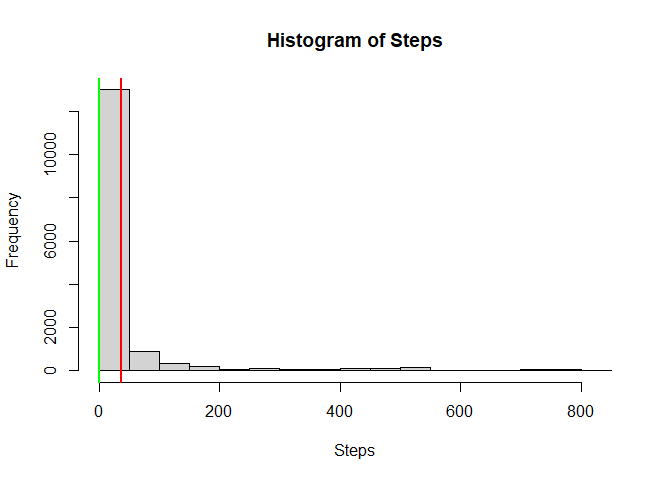
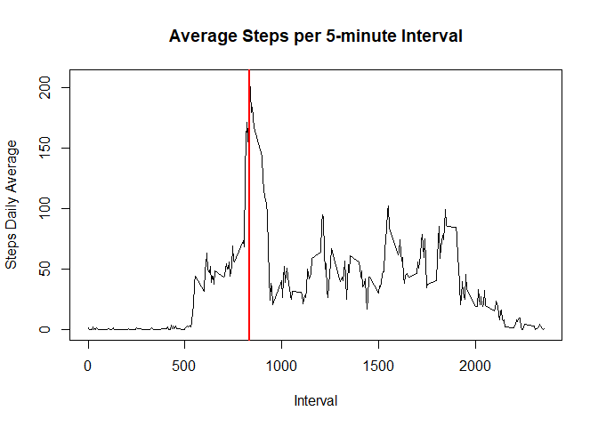
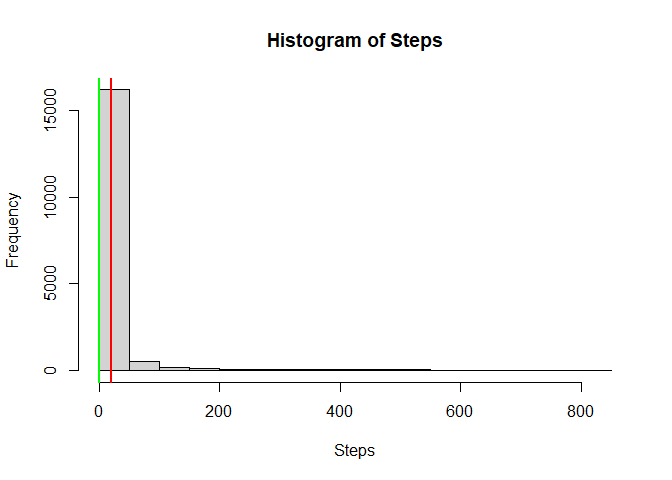
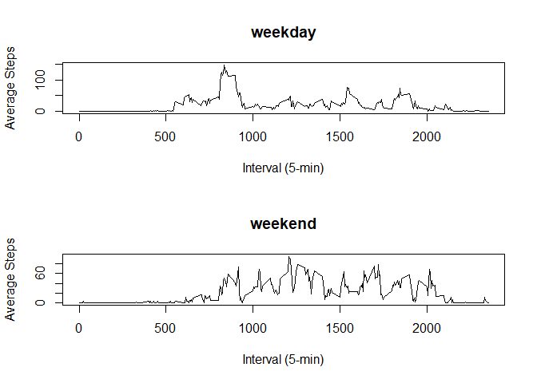

## Loading and preprocessing the data

First we to decompress the data set provided with the git repo fork. As of July 29th, 2020
it can be downloaded at this [link](https://d396qusza40orc.cloudfront.net/repdata%2Fdata%2Factivity.zip)

```r
#Decompress the provided zip file and get the filename.
filename <- unzip("activity.zip")
#Read in the data while specifying the column class types.
raw_activity <- read.csv(filename, colClasses = c("numeric", "Date", "numeric"))
```

After ingesting and performing light processing of the data we can take a look at
it to see what we are dealing with.

Lets look at the contents first:

```r
#Display some information on the data set
head(raw_activity)
```

```
##   steps       date interval
## 1    NA 2012-10-01        0
## 2    NA 2012-10-01        5
## 3    NA 2012-10-01       10
## 4    NA 2012-10-01       15
## 5    NA 2012-10-01       20
## 6    NA 2012-10-01       25
```

Also provide a quick summary:

```r
summary(raw_activity)
```

```
##      steps             date               interval     
##  Min.   :  0.00   Min.   :2012-10-01   Min.   :   0.0  
##  1st Qu.:  0.00   1st Qu.:2012-10-16   1st Qu.: 588.8  
##  Median :  0.00   Median :2012-10-31   Median :1177.5  
##  Mean   : 37.38   Mean   :2012-10-31   Mean   :1177.5  
##  3rd Qu.: 12.00   3rd Qu.:2012-11-15   3rd Qu.:1766.2  
##  Max.   :806.00   Max.   :2012-11-30   Max.   :2355.0  
##  NA's   :2304
```

## What is mean total number of steps taken per day?

Continuing with our raw_activity data set from above we will need to calculate the
mean step value per day (omitting the NA values).


```r
#Omit the rows with NA values
cc_activity <- raw_activity[complete.cases(raw_activity),]

#Calculate mean and median values of steps. 
step_mean <- mean(cc_activity$steps)

#Pull out steps as a numeric vector and sort.
step_median <- median(sort(cc_activity$steps))
```

Based on the cleaned dataframe and calculated values we can plot the histogram below.
This shows the frequency of steps values in the data set. The **mean, 37.3825996**, 
is displayed in the histogram below as well as the **median, 0**. 
The mean is display in red and the median in green.


```r
#Plot a histogram base on the complete cases using steps
hist(cc_activity$steps, xlab = "Steps", main = "Histogram of Steps")
abline(v=step_median, col = "green",lwd=2)
abline(v=step_mean, col="red", lwd=2)
```

<!-- -->


## What is the average daily activity pattern?

Expanding upon the dataset from the previous question we need to calculate the average steps per 5 minute interval.

```r
#Reuse the cc_activity dataframe since it has been cleansed of NA values
# and calculate a daily average
interval_avg <- aggregate(cc_activity$steps, list(cc_activity$interval), mean)
colnames(interval_avg) <- c("interval", "interval.avg")

#We merge the to dataframes on Date
interval_avg_activity <- merge(cc_activity, interval_avg, by = "interval")
#Determine the interval with largest average steps.
interval_steps_max <- interval_avg_activity[which.max(interval_avg_activity$interval.avg),]$interval
```

After performing the dataframe manipulations and calculations above, we can simply plot a line chart. As you can tell in the line chart, the peak activity is at the **835** interval, indicated by the vertical redline.

```r
plot(interval_avg_activity$interval, interval_avg_activity$interval.avg, xlab = "Interval", ylab = "Steps Daily Average", type="l", main="Average Steps per 5-minute Interval")
abline(v=interval_steps_max, col="red", lwd=2)
```

<!-- -->

## Imputing missing values

The orginal dataset has multiple NA values in the Steps column. Let's see how many there are.

```r
sum_na <- sum(is.na(raw_activity$steps))
```
Using the code above there are **2304** NA values in this dataset. The strategy we will use to replace those values is the following:

1. Replace NA values with the daily average if available.
2. Replace NA values with the interval average if available.
3. Replace remaining NA values with 0.


```r
#Calculate daily mean
daily_mean <- aggregate(cc_activity$steps, list(cc_activity$date), mean)
colnames(daily_mean) <- c("date", "date.avg")
dates <- as.data.frame(unique(raw_activity$date))
colnames(dates) <- c("date")
daily_mean<-merge(dates, daily_mean, by="date", all.x = TRUE)

#Get a copy of the raw data set for processing
rmna_activity <- raw_activity

#Replace values based on daily averages where available
for(i in 1:nrow(daily_mean)){
  mean_val <- daily_mean[i,"date.avg"]
  curr_date <- as.Date(daily_mean[i,"date"])
  rmna_activity[is.na(rmna_activity[rmna_activity$date==curr_date,]),"steps"] <- mean_val
}

#Days without a daily average will have thier NAs replaced by interval means
for(i in 1:nrow(interval_avg)){
  mean_val <- interval_avg[i,"interval.avg"]
  curr_interval <- as.numeric(interval_avg[i,"interval"])
  rmna_activity[is.na(rmna_activity[rmna_activity$interval==curr_interval,]),"steps"] <- mean_val
}

#Replace any remaining NAs with 0
rmna_activity[is.na(rmna_activity)] <- 0

rmna_activity$steps <- as.numeric(rmna_activity$steps)

#Calculate mean and median values of steps. 
step_mean <- mean(rmna_activity$steps)

#Pull out steps as a numeric vector and sort.
step_median <- median(sort(rmna_activity$steps))
```

Based on the cleaned dataframe and calculated values we can plot the histogram below.
This shows the frequency of steps values in the data set. The **mean, 20.6963486**, 
is displayed in the histogram below as well as the **median, 0.1423611**. 
The mean is display in red and the median in green.


```r
#Plot a histogram base on the complete cases using steps
hist(rmna_activity$steps, xlab = "Steps", main = "Histogram of Steps")
abline(v=step_median, col = "green",lwd=2)
abline(v=step_mean, col="red", lwd=2)
```

<!-- -->


## Are there differences in activity patterns between weekdays and weekends?
Below is a chart showing the differences in activity on the 5-minute intverals between weekdays and weekends.


```r
#c("Monday", "Friday","Saturday", "Sunday", "Thursday","Tuesday","Wednesday")
lbl <- c("weekday","weekday","weekend","weekend","weekday","weekday","weekday")


#Use weekdays() function to create a factor based on the date.  The weekdays function will require 7 labels and the weekend and weekday values are mapped to the days in alphabetical order
rmna_activity$day.type <- factor(weekdays(rmna_activity$date), labels = lbl)

interval_avg2 <- aggregate(rmna_activity$steps, list(rmna_activity$day.type,rmna_activity$interval), mean)
colnames(interval_avg2) <- c("day.type", "interval", "interval.avg.day.type")


par(mfrow=c(2,1))

for(i in levels(interval_avg2$day.type)) {
  plot(interval_avg2[interval_avg2$day.type == i, "interval"], interval_avg2[interval_avg2$day.type == i, "interval.avg.day.type"],
       xlab = "Interval (5-min)",
       ylab = "Average Steps",
       type = "l",
       main = paste(i)) 
}
```

<!-- -->


